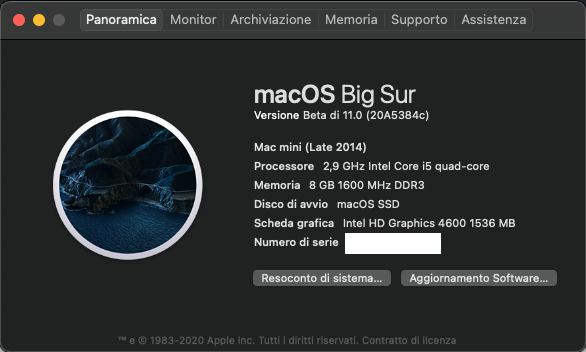

# Dell Optiplex 3060 MFF Hackintosh

EFI for Dell Optiplex 9020 USFF with OpenCore bootloader

### Computer Spec:

| Component        | Brank                              |
| ---------------- | ---------------------------------- |
| CPU              | Intel i5 4570s (4C-4T 6MB HSW)     |
| iGPU             | Intel® HD Graphics 4600            |
| Lan              | Intel I217LM                       |
| Wifi + BT        | BCM94360HMB (AW-CB160H)            |
| Audio            | Realtek ALC280                     |
| Ram              | 8 GB DDR3 1600 Mhz                 |
| SSD              | SAMSUNG 850 EVO 250 GB (MACOS)     |
| SSD              | CRUCIAL BX500 120 GB (WINDOWS)     |
| SmBios           | Macmini 7,1                        |
| BootLoader       | OpenCore                           |

## Peripherals

### What works and What doesn't or WIP:

- [x] Intel HD Graphics 4600 iGPU HDMI/DP Output
- [x] ALC280 Internal Speakers
- [x] ALC280 HDMI/DP Audio Output
- [x] ALC280 jack microphone
- [x] ALC280 jack headphones
- [x] All USB Ports 
- [x] SpeedStep / Sleep / Wake
- [x] Intel I217LM LAN
- [x] Wi-Fi and Bluetooth BCM94360HMB (AW-CB160H) Module
- [x] HID Key PWRB & SLPB 
- [x] CONTROLLER SATA III
- [x] NVRAM
- [x] Windows 10 boot from OpenCore

### Special Config:

- Usb port mapping performed
- SSDT-Hack Essential patch
- Applied cosmetics PCI Dev

See [ioreg](./ioregmac.ioreg) for more clarification

## Credits

- [Apple](https://apple.com) for macOS;
- [Acidanthera](https://github.com/acidanthera) for OpenCore and all the lovely hackintosh work.
- [Dortania](https://dortania.github.io/OpenCore-Install-Guide/config-laptop.plist/icelake.html) For great and detailed guides.
- [Hackintoshlifeit](https://github.com/Hackintoshlifeit)

# If you need help please contact us on [Telegram](https://t.me/HackintoshLife_it) or [Web](https://www.hackintoshlife.it/)
